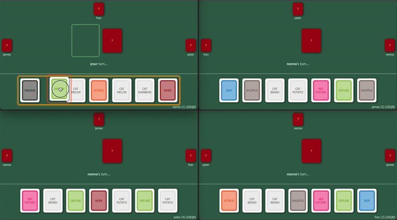

# Card Game Engine



An implementation of a popular card game, with multiplayer support. The server uses a Finite State Machine (more precisely Finite State Acceptor) to track game state and uses event sourcing from the clients to evolve the state.

The current implementation is easy to extend, and has the potential to be adapted to other card games and possibly even other turn based games in general.

<hr>

## How to run

Run the server (requires node version >=14) 
```bash
cd server && node .
```

This will run the server from your machine on port 3000. Go to localhost:3000 and create a new game (take note of the 4 letter game ID).

4 players are required. Other players can join the game on your network from your network address (e.g. 192.168.1.X:3000). Once there they will need to enter their name and the 4 letter game ID and click 'join'.

If you don't have enough players, you can run player bots to make up the numbers. To create a bot:
```bash
node bot http://[host]:3000 [game id]
```
e.g.:
```bash
node bot http://localhost:3000 ABCD
```
<hr>

enjoy!